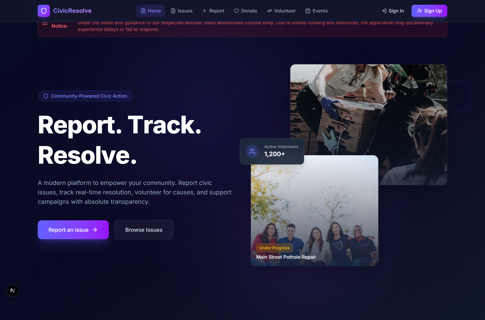
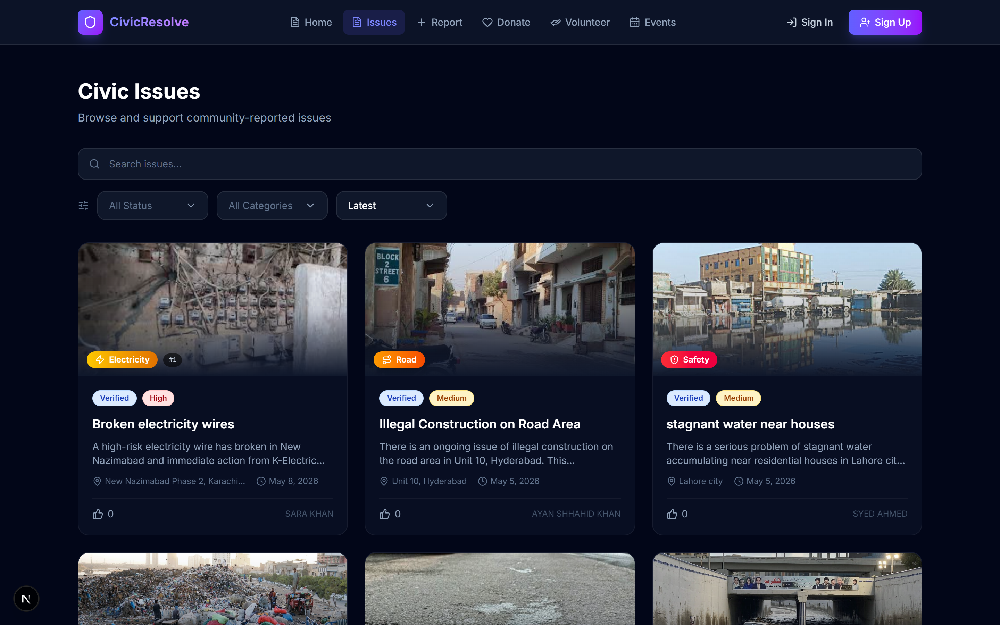
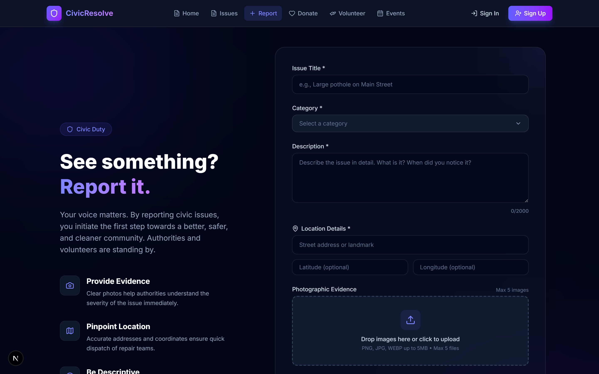
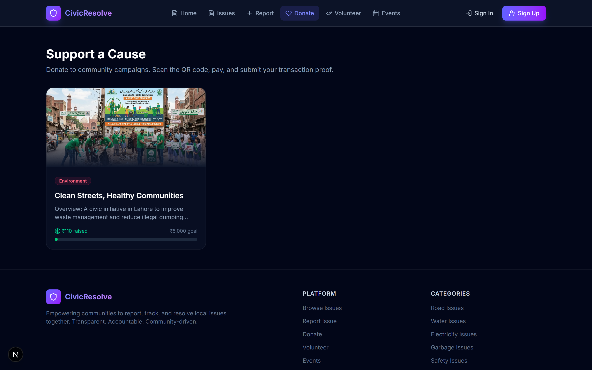
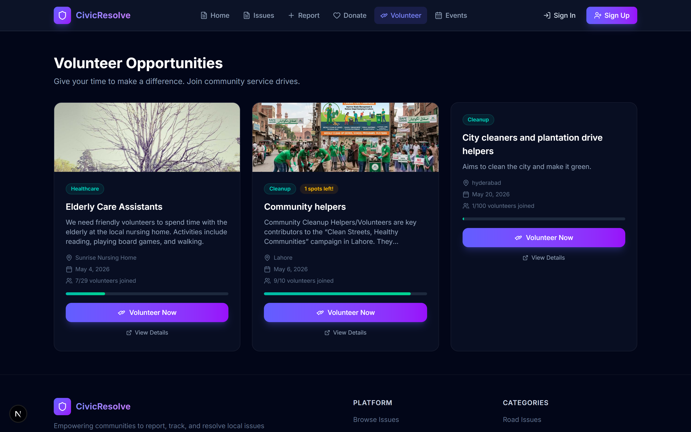

# CivicResolve - Community-Driven Civic Platform

**CivicResolve** is a full-stack, community-driven civic platform engineered with Next.js 16, React 19, TypeScript, Tailwind CSS v4, Leaflet geospatial mapping, NextAuth.js v5, Mongoose, and GSAP animations. It empowers citizens to report local municipal issues, track resolution timelines with local authorities, participate in community volunteer drives, and fund infrastructure campaigns with zero-fee QR donations.

---

## Unique Feature Showcase

### Civic Incident Reporting & Resolution Portal
An interactive landing and incident reporting portal where citizens can submit municipal issues, track status updates, and review resolution statistics.



---

### Public Civic Complaints & Upvoting Directory
A real-time public directory displaying municipal issues with priority tags, status indicators (Pending, In Progress, Resolved), and community upvoting to boost issue visibility.



---

### Map-Based Issue Submission & Location Tracking
An interactive geospatial reporting interface powered by Leaflet maps, enabling citizens to pinpoint exact issue coordinates, upload photos, and classify issue categories.



---

### Zero-Fee QR Donation Campaigns
A community funding module presenting verified infrastructure projects, target metrics, and direct UPI QR payment validation for zero-fee peer-to-peer donor support.



---

### Volunteer & Community Event Hub
A centralized portal for discovery and enrollment in local clean-up drives, civic relief initiatives, and community events with attendee management.



---

## Tech Stack & Architecture

- **Core Framework**: [Next.js 16](https://nextjs.org/) (App Router, Turbopack, React 19)
- **Language**: [TypeScript](https://www.typescriptlang.org/)
- **Styling**: [Tailwind CSS v4](https://tailwindcss.com/)
- **Geospatial Mapping**: [Leaflet](https://leafletjs.com/) & [React-Leaflet](https://react-leaflet.js.org/)
- **Authentication**: Auth.js ([NextAuth v5 Beta](https://next-auth.js.org/)) with Mongoose & bcryptjs
- **Database & ODM**: [MongoDB](https://www.mongodb.com/) & [Mongoose v9](https://mongoosejs.com/)
- **Media Storage**: [Cloudinary](https://cloudinary.com/) & `next-cloudinary`
- **Email & Communications**: [Resend](https://resend.com/)
- **Validation**: [Zod v4](https://zod.dev/)
- **Animations**: [GSAP 3](https://gsap.com/) (`@gsap/react`)
- **Iconography**: [Lucide React Icons](https://lucide.dev/)

---

## Directory Structure

```
civics-project/
├── public/                 # Static branding assets and images
├── screenshots/            # Showcase screenshots
├── src/
│   ├── actions/            # Server Actions (Complaints, Donations, Community)
│   ├── app/                # Next.js App Router pages and API routes
│   │   ├── api/            # Authentication & media upload endpoints
│   │   ├── complaints/     # Complaints directory & detail pages
│   │   ├── dashboard/      # Role-based admin & user management dashboard
│   │   ├── donate/         # Donation campaigns & payment verification
│   │   ├── events/         # Community events portal
│   │   ├── submit/         # Map-based issue submission page
│   │   └── volunteer/      # Volunteering opportunities portal
│   ├── components/         # Reusable navigation, map, and form components
│   ├── controllers/        # Server-side data processing logic
│   ├── lib/                # Database connection, auth config, Zod schemas
│   ├── models/             # Mongoose schemas (User, Complaint, Donation, Event, Volunteer)
│   └── types/              # TypeScript type declarations
└── package.json
```

---

## Getting Started

### Prerequisites
- Node.js 18+
- pnpm / npm / yarn
- MongoDB Instance

### Installation

1. **Clone the repository**:
   ```bash
   git clone https://github.com/ARafaykhalid/civics-project.git
   cd civics-project
   ```

2. **Install dependencies**:
   ```bash
   pnpm install
   ```

3. **Configure Environment Variables**:
   Create a `.env.local` file:
   ```env
   MONGODB_URI=your_mongodb_connection_string
   AUTH_SECRET=your_auth_secret_key
   CLOUDINARY_CLOUD_NAME=your_cloudinary_name
   CLOUDINARY_API_KEY=your_cloudinary_api_key
   CLOUDINARY_API_SECRET=your_cloudinary_api_secret
   RESEND_API_KEY=your_resend_api_key
   ```

4. **Run Development Server**:
   ```bash
   pnpm dev
   ```
   Open [http://localhost:3000](http://localhost:3000) in your browser.

---

## License

This project is open-source under the [MIT License](LICENSE).
